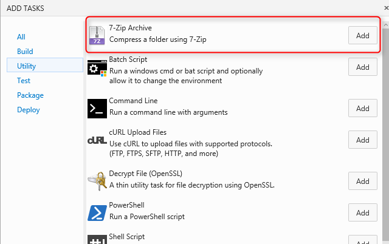

### How to use **7-Zip** build / release tasks

Install from the Marketplace 

Marketplace - https://marketplace.visualstudio.com/items?itemName=TotalALM.totalalm-7zip

OR

Follow the below steps to upload this task to your account:

* Download the tasks repo as [zip file] or clone it using git: 
* Extract the zip file of the desired task
* Open command prompt and navigate to the folder that contains a json and powershell files.

## Install / Upload Custom Task

*Follow instructions on how to upload the task using - https://github.com/TotalALM/VSO-Tasks

## How to use

* Add a new task and select 7-Zip Archive.

* Input or Select Folder to archive.
* Input archive file to archive the folder into. (This can be new or existing.)
* Select the archive file format; 7z or zip.
* Remove Folder After Compression - When checked, the folder will be removed after the compression is complete.

