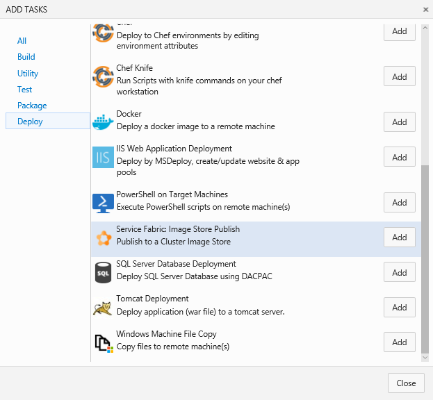
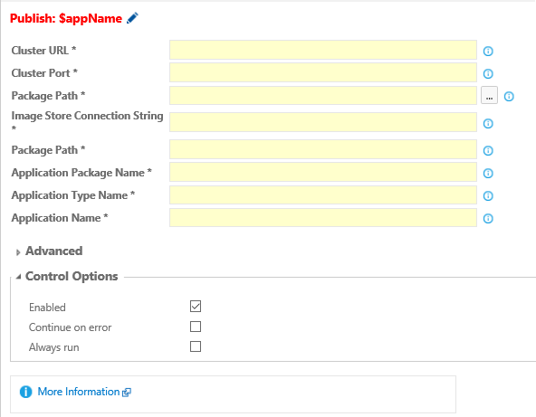

### How to use **Publish to Cluster Image Store** build / release deploy tasks

Follow the below steps to upload this task to your account:

* Download the tasks repo as [zip file] or clone it using git:
* Extract the zip file of the desired task
* Open command prompt and navigate to the folder that contains a json and powershell files.

## Install / Upload Custom Task

*Follow instructions on how to upload the task using - https://github.com/TotalALM/VSO-Tasks

## How to use

* Add a new task and select Publish to Cluster Image Store.

* Input the required Values.

* More details to come...