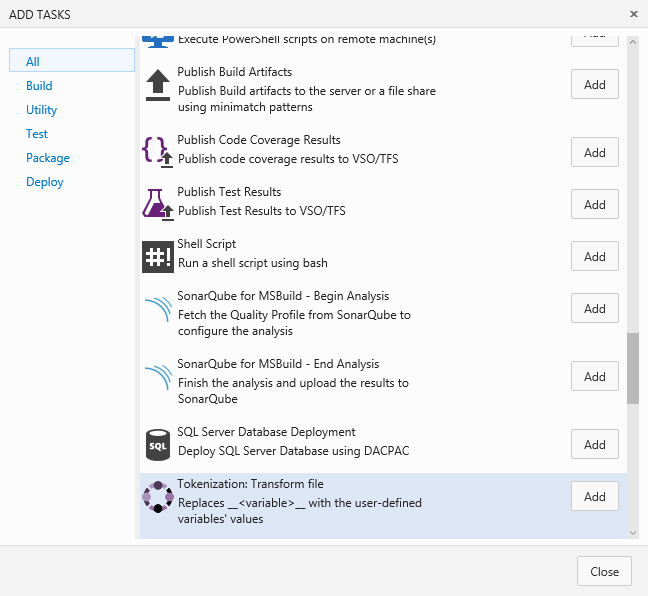
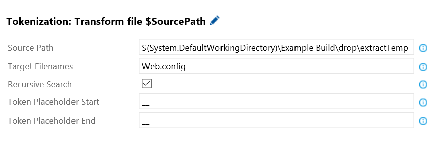
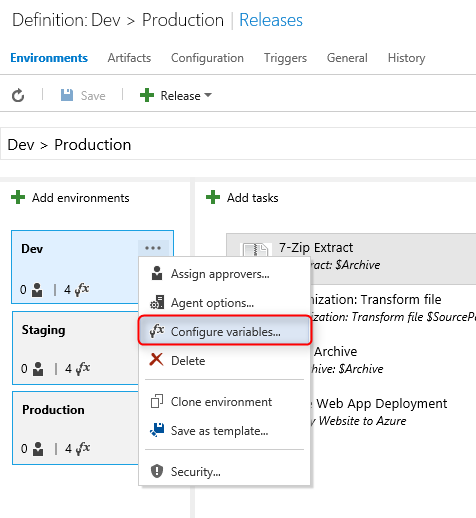

### How to use **Tokenization** build / release tasks

Install from the Marketplace 

Marketplace - https://marketplace.visualstudio.com/items?itemName=TotalALM.totalalm-tokenization

OR

Follow the below steps to upload this task to your account:

* Download the tasks repo as [zip file] or clone it using git:
* Extract the zip file of the desired task
* Open command prompt and navigate to the folder that contains a json and powershell files.

## Install / Upload Custom Task

*Follow instructions on how to upload the task using - https://github.com/TotalALM/VSO-Tasks

## How to use

* Add a new task and select Tokenization.

## Variables

| **Field** | **Information** | **Required** |
| --- | --- | --- |
| Source Path | "Source path to start looking recursively for the TargetFileName that contains the tokens (<prefix><variablename><suffix>). These patterns will be replaced with user-defined variables. | Yes |
| Target Filenames | The target filenames (comma-delimited) that have tokens replaced by user-defined variables. Wild card searching is support.  Example: Web.config or *.config or Settings.xml, *.config | Yes |
| Recursive Search | Recursively Search through all folders in the Source Path  | Yes |
| Token Placeholder Start | The token place holder at the front of the variable name. [__]<variable-name>__ | Yes |
| Token Placeholder End | The token place holder at the end of the variable name.  __<variable-name>[__] | Yes |

* Add your environment variables

* If your Web.config has a value '__Environment__' you would only enter the 'Environment' leaving out the '__' at the beginning and end. 

* Simply check the lock if you wish to encrypt the value.  Decryption will happen automatically and requires no extra effort. 
