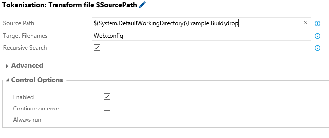

### How to use **Tokenization** build / release tasks

Follow the below steps to upload this task to your account:

* Download the tasks repo as [zip file] or clone it using git:
* Extract the zip file of the desired task
* Open command prompt and navigate to the folder that contains a json and powershell files.

## Install / Upload Custom Task

*Follow instructions on how to upload the task using - https://github.com/TotalALM/VSO-Tasks

## How to use

* Add a new task and select Tokenization.


* Type of select the Source Path to search. 
* Unput Target Filenames.  This can be a single value or comma-delimited list of names.  Wild Card searces are supported using "*"

```bash
Web.config
*.config
Settings.xml, *.config
```

* Recursive  - When checked, tokenization task will recursively go through all folders in the Source Path.



